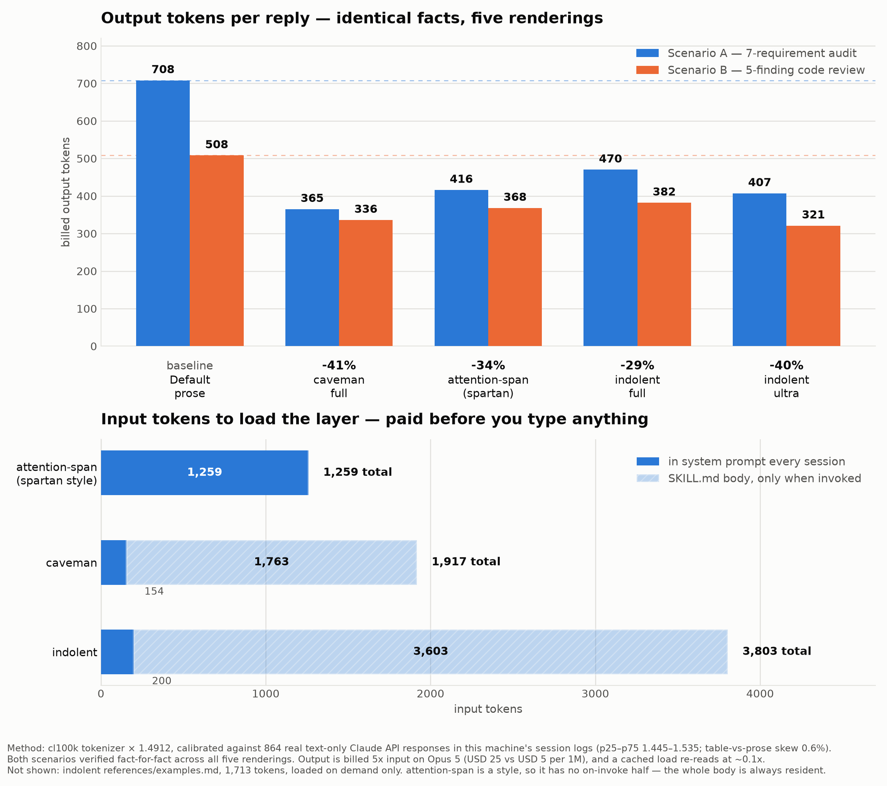

# indolent

> Table-first output mode for AI coding agents. Built for developers who skim.

`/indolent` turns findings, audits, comparisons, plans, status and risks into **table matrices** with a fixed status vocabulary, turns relationships into small ASCII diagrams, and leaves prose only for the one-line answer and the "so what" under each table. Words are compressed [caveman](https://github.com/juliusbrussee/caveman)-style; structure is [attention-span](https://github.com/alexgreensh/attention-span)-style (answer first, bold carries the answer). Facts are never compressed: rows, numbers, thresholds, identifiers and warnings always survive.

Follows the [Agent Skills](https://agentskills.io) open format, so one folder installs into Claude Code, Codex, Cursor, Gemini CLI, GitHub Copilot, OpenCode and 75+ other agents.

## Why

| Problem | What indolent does |
|---|---|
| Long explanations get skimmed; the line that mattered gets skipped | Line one is the whole answer; every multi-item finding is a titled table |
| "Put it in a table" is a per-prompt tax | One `/indolent` makes it the session default |
| Compression usually drops facts | Words are compressed; rows, numbers, thresholds and warnings never are |

## Before / after

**Before**

> I went through the requirements in the spec. REQ-01, rate limiting on login, is fully met, there are tests in LoginRateLimitTest covering it. REQ-02, the password-reset token, is partially there but the spec says the token must expire in 15 minutes while the implementation uses 24 hours, so I'd call that disputed. REQ-07, audit-log export, I couldn't find an export route at all…

**After**

**5 of 7 met; REQ-02 disputed, REQ-07 not met.**

**Requirements — auth service spec §3**

| ID | Requirement | Status | Evidence | Gap |
|---|---|---|---|---|
| REQ-01 | Rate-limit login, 5 attempts per 15 min | **Met** | `LoginRateLimitTest`, tests 4, 5 | — |
| REQ-02 | Password-reset token expires in 15 min | **Disputed** | `ResetToken::ttl()` returns 24h | Spec says **15 min**; 24h in code. Q-002 open |
| REQ-07 | Audit-log export (CSV) | **Not met** | Only `GET /audit/{id}`, single-record read | **No export route exists** |

**REQ-07 blocks the compliance duty in spec §5; nothing implements it.**

More shapes (inventory, risk register, metrics, options, plan, root cause, code review, diagram): [`skills/indolent/references/examples.md`](skills/indolent/references/examples.md).

## Install

### One command, any agent

Uses the [skills.sh](https://skills.sh) CLI by Vercel. Detects the agents on your machine and installs into each one's skills directory.

```bash
npx skills add adrisyukran/indolent-skill              # this project only
npx skills add adrisyukran/indolent-skill -g           # every project (global)
npx skills add adrisyukran/indolent-skill -a claude-code -a codex -a cursor   # pick agents
```

### Claude Code

Pick one.

```bash
# a) skills.sh
npx skills add adrisyukran/indolent-skill -a claude-code -g

# b) plugin (inside Claude Code)
/plugin marketplace add adrisyukran/indolent-skill
/plugin install indolent@indolent-skill

# c) manual: global
git clone https://github.com/adrisyukran/indolent-skill.git
cp -r indolent-skill/skills/indolent ~/.claude/skills/indolent

# d) manual: this project only
cp -r indolent-skill/skills/indolent .claude/skills/indolent
```

Start a new session, then `/indolent`, `/indolent lite`, `/indolent ultra`, `/indolent off`.

### Codex CLI and IDE extension

Codex reads `~/.agents/skills/` (personal) and `.agents/skills/` (repo). The older `~/.codex/skills/` location, where skills.sh installs, is still read too.

```bash
npx skills add adrisyukran/indolent-skill -a codex -g
# or
cp -r indolent-skill/skills/indolent ~/.agents/skills/indolent
```

Invoke with `$indolent` in the prompt, list with `/skills`. Codex also picks it implicitly when the task matches the description. Restart Codex if it does not appear.

### Cursor

Cursor reads `~/.cursor/skills/` and `.cursor/skills/`, and for compatibility also `~/.claude/skills/`, `~/.codex/skills/`, `~/.agents/skills/` and their project equivalents. An install for Claude Code or Codex is already visible to Cursor.

```bash
npx skills add adrisyukran/indolent-skill -a cursor -g
```

Type `/` in Agent chat and pick `indolent`, or let it trigger automatically.

### Gemini CLI

```bash
gemini skills install https://github.com/adrisyukran/indolent-skill.git --consent
gemini skills list --all
```

Reads `~/.gemini/skills/` (or `~/.agents/skills/`) and `.gemini/skills/` (or `.agents/skills/`). Activates automatically with a confirmation prompt.

### GitHub Copilot (CLI, coding agent, VS Code agent mode)

Repository: `.github/skills/indolent/` (also reads `.claude/skills/` and `.agents/skills/`). Personal: `~/.copilot/skills/indolent/` or `~/.agents/skills/indolent/`.

```bash
gh skill install adrisyukran/indolent-skill indolent      # GitHub CLI, preview feature
# or
npx skills add adrisyukran/indolent-skill -a github-copilot
# or
cp -r indolent-skill/skills/indolent .github/skills/indolent
```

### OpenCode

Reads `.opencode/skills/`, `.claude/skills/`, `.agents/skills/` in the project and `~/.config/opencode/skills/`, `~/.claude/skills/`, `~/.agents/skills/` globally. A Claude Code install is already visible.

```bash
npx skills add adrisyukran/indolent-skill -a opencode -g
```

### Any other agent

Copy `skills/indolent/` into `~/.agents/skills/indolent/` (the cross-agent convention read by Codex, Cursor, Gemini CLI, Copilot, OpenCode, Cline and Amp) or into the agent's own skills directory. The only hard requirement is a folder named `indolent` containing `SKILL.md`.

| Agent | `npx skills add … -a` | Global path |
|---|---|---|
| Windsurf | `windsurf` | `~/.codeium/windsurf/skills/` |
| Amp | `amp` | `~/.config/agents/skills/` |
| Cline | `cline` | `~/.agents/skills/` |
| Kiro CLI | `kiro-cli` | `~/.kiro/skills/` |
| All detected agents | `'*'` | per agent |

### Uninstall

Delete the `indolent` folder from wherever it was installed, or `npx skills remove indolent`.

## Usage

| Command | Effect |
|---|---|
| `/indolent` | `full` (default) |
| `/indolent lite` | Tables for findings, reports, audits, plans, status. Prose elsewhere, full sentences, no filler |
| `/indolent full` | Tables for anything with 2+ items sharing attributes. Caveman words in prose and cells |
| `/indolent ultra` | Tables and diagrams only. Prose limited to line one and so-what lines. Cells at most 8 words |
| `/indolent off` | Back to the agent's normal output |

Agents without slash commands: `$indolent` (Codex), the `/` picker (Cursor), or plain words such as "indolent ultra". Also triggers on "table it", "matrix", "show me a table", "too much text", "visualize this". Stays active for the session until `off`, "stop indolent" or "normal mode".

## What it enforces

| Rule | Detail |
|---|---|
| Line one is the whole answer | One sentence; a reader who stops there has the verdict |
| Multi-item content is a table | 11 column recipes, e.g. `ID · Requirement · Status · Evidence · Gap`, `Symptom · Cause · Evidence · Fix` |
| Fixed status words | **Met / Partial / Not met / Disputed / Not measured**; ✓ ✗ —; Blocker / High / Med / Low; Done / In progress / Blocked / Todo |
| Every table titled, so-what line beneath | `**Risk register — PRD §10**` above; one bold conclusion below when the status column alone does not carry it |
| Relationships are diagrams | Flow, dependency, state, sequence: ASCII in a fenced block, at most 15 lines. Mermaid only where it renders |
| Words compressed, facts never | Caveman word rules; numbers, thresholds, identifiers, warnings and rows are never cut |

## Tokenomics

`indolent` is **not** a token-saving layer. Measured against default prose on two matched scenarios (same facts, verified fact-for-fact):

| Mode | Output tokens per reply | vs default prose |
|---|---|---|
| Default prose | 608 | baseline |
| caveman `full` | 350 | −41% |
| `indolent ultra` | 364 | −40% |
| attention-span (`spartan`) | 392 | −34% |
| `indolent full` | 426 | −29% |

It also costs the most to load: `SKILL.md` is 3,603 tokens on invocation plus 200 always resident, roughly double caveman's. In money the difference is noise — about **USD 0.16** over a 40-reply session on Opus 5.

What it buys instead: across those two scenarios `indolent` forced an explicit status word (**Met / Partial / Not met / Disputed / Not measured**) into **12 cells**; prose, caveman and attention-span produced **zero**, encoding severity narratively as "the most serious one" or "this is where things get complicated". A skimmer reads a status column and skips the narrative. That is the reason to run it.

Full method, calibration against 864 real Claude API responses, break-even analysis and the table-markup micro-optimization study: [`docs/tokenomics.md`](docs/tokenomics.md).



## Carve-outs

Word-compression turns **off** (full sentences in every cell and prose block) for security findings, audit evidence, approval records, QA reports, destructive-action warnings, order-sensitive procedures, and any "explain / why / walk me through" request. Tables may remain in those cases because a table is structure, not compression, but every row stays and every cell is a complete sentence. Commit messages are never tabulated or compressed. The mode never overrides a human-owned gate or approval step, never alters code, and never shrinks an evidence document written to disk; it governs the chat reply only.

## Compatibility with other output layers

| Layer | With indolent |
|---|---|
| [caveman](https://github.com/juliusbrussee/caveman) | Redundant, not conflicting: indolent already carries the same word rules. Don't load both |
| [attention-span](https://github.com/alexgreensh/attention-span) output styles (`attention-kind`, `rundown`, `spartan`) | Structure agrees, words conflict (they mandate plain English and cap tables at 5 rows). Use `/indolent lite` with them, or switch the style to default for `full` / `ultra` |
| Code-minimalism skills (e.g. ponytail), bash-output filters (e.g. rtk) | Orthogonal. Fine together |

## Repository layout

```
indolent-skill/
├── skills/
│   └── indolent/
│       ├── SKILL.md                 # the skill (Agent Skills format)
│       └── references/examples.md   # worked table shapes, loaded on demand
├── .claude-plugin/
│   ├── plugin.json                  # Claude Code plugin manifest
│   └── marketplace.json             # lets /plugin marketplace add point at this repo
├── CHANGELOG.md
├── LICENSE                          # MIT
└── README.md
```

## Provenance and licence

MIT. Principles borrowed from two upstreams; **no text copied** from either.

| Upstream | Borrowed | Upstream licence |
|---|---|---|
| [juliusbrussee/caveman](https://github.com/juliusbrussee/caveman) | Word-level compression rules, lite / full / ultra levels, auto-clarity carve-outs | MIT for the skill files (the engine runtime is BSL-1.1 and is not used here) |
| [alexgreensh/attention-span](https://github.com/alexgreensh/attention-span) v0.7 | Answer-first line one, bold carries the answer, one idea per block, never cut a warning | AGPL-3.0 |

Because no attention-span text was copied, this repo is not an AGPL derivative. **Do not paste text from attention-span's style files into `SKILL.md`; that would make the file AGPL-3.0.**

Payload: markdown only. No scripts, hooks, network calls or dependencies.

## Contributing

- Keep `SKILL.md` under 500 lines and self-contained; put long material in `references/` (one level deep).
- `name` must stay `indolent` and match the folder name; `description` under 1024 characters.
- Examples must be fictional. No client, project or personal data.
- Smoke-test discovery from a local checkout: `npx skills add . -l` from the repo root (list only, installs nothing).
- Bump `version` in `SKILL.md`, `plugin.json`, `marketplace.json` and `CHANGELOG.md` together.
