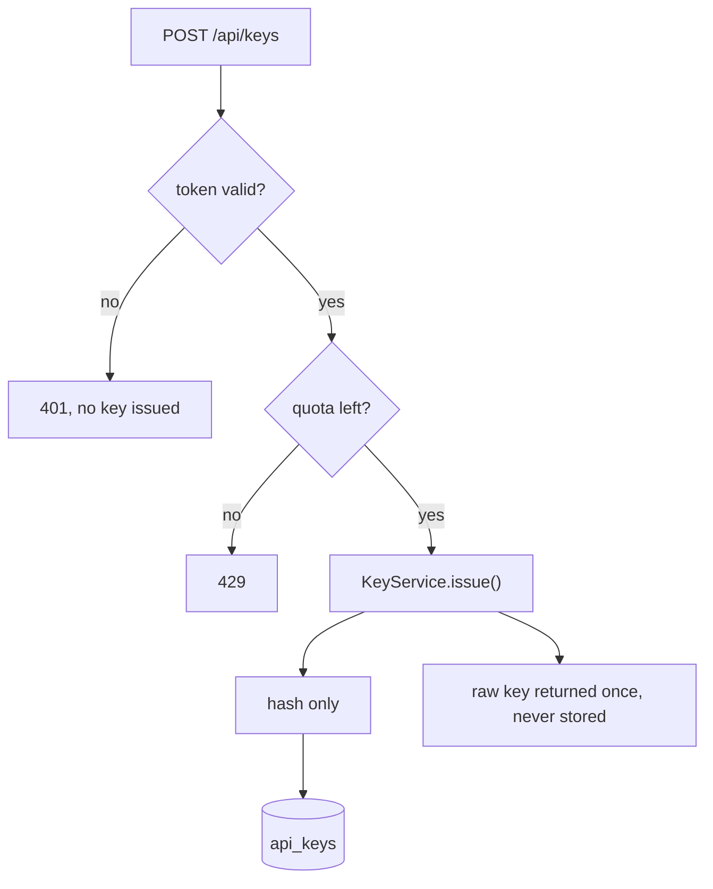
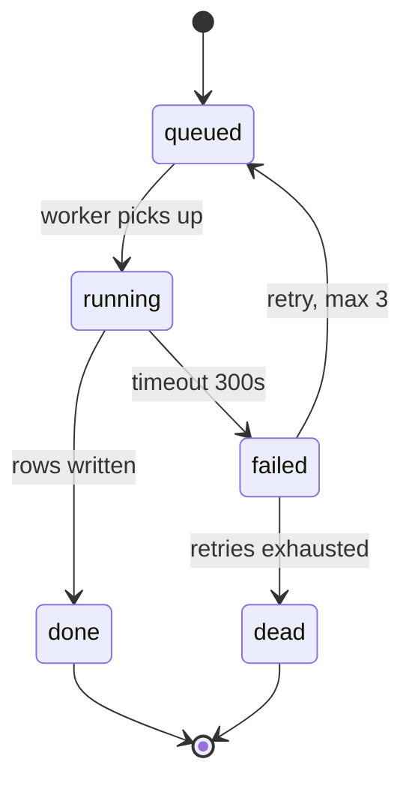

# Indolent — worked shapes

All examples are fictional. Load this file only when a table shape or diagram form is unclear; `SKILL.md` already carries the rules.

## The shape, end to end

User: "How does the auth service look against the spec?"

Not a paragraph walking REQ-01, then REQ-02, then REQ-07, verdicts buried mid-clause. This:

**5 of 7 met; REQ-02 disputed, REQ-07 not met.**

**Requirements — auth service spec §3**

| ID | Requirement | Status | Evidence | Gap |
|---|---|---|---|---|
| REQ-01 | Rate-limit login, 5 attempts per 15 min | **Met** | `LoginRateLimitTest`, tests 4, 5 | — |
| REQ-02 | Password-reset token expires in 15 min | **Disputed** | `ResetToken::ttl()` returns 24h | Spec says **15 min**; 24h in code. Q-002 open |
| REQ-07 | Audit-log export (CSV) | **Not met** | Only `GET /audit/{id}`, single-record read | **No export route exists** |

**REQ-07 blocks the compliance duty in spec §5; nothing implements it.**

## Inventory vs built

**Screens — prototype vs built**

| # | Prototype screen | Built as | Status |
|---|---|---|---|
| 1 | Sign-in | `Auth/SignIn.vue` | ✓ |
| 2 | My tasks | — | ✗ Phase 9, REQ-14 |
| 3 | Inbox | `Conversations/Index.vue` | ✓ |
| 4 | Corpus (upload, versions, supersede) | — | ✗ API only |
| 5 | Audit trail | `Audit/Index.vue` | ✓ |

**Two screens have no UI; both have complete backends.**

## Risk register

**Risk mitigations — PRD §10**

| Risk | Mitigation status | Owner |
|---|---|---|
| Sourced but wrong | **Met** — section-boundary chunking, 0.70 threshold. Dispute rate **unmonitored** | Backend |
| Unmaintained corpus | **Met** — review dates, stale report, supersede flow | Content |
| Reviewer approves unread | **Partial** — per-citation confirm with reasons. Unchanged-acceptance rate **unmonitored** | Product |
| Confidential document uploaded | **Partial** — type and size checked. **No classification check** | Security |

## Metric / target

**Phase 1 gate metrics — PRD §9**

| Metric | Target | Status |
|---|---|---|
| Sourced-answer rate | ≥95% | **Not measured** |
| Escalation resolution | 48h at p90 | **Not measured** |
| Cross-tenant leakage | Zero, continuous | Enforced, **not monitored** |
| Stale corpus | Zero indexed past review date | Detection built (test 16), **not reported as a metric** |

**None of the four is computed anywhere, so the gate cannot be evidenced today whatever the code quality.**

## Non-functional

**Non-functional — PRD §8**

| Aspect | Target | Status | Gap |
|---|---|---|---|
| Latency | Answer in 4s at p95 | **Not measured** | No load harness |
| Availability | 99.5%, degrade to fallback | **Partial** | Fallback met (test 24); uptime unmeasurable in PoC |
| Data residency | All storage **and inference** in-region | **Not met** | Region not live. Q-001 unanswered |
| Accessibility | WCAG 2.1 AA, widget **and** console | **Partial** | Design done both sides; no conformance audit |

## Options / decision

**Session store**

| Option | For | Against | Pick |
|---|---|---|---|
| Redis | Already deployed, TTL native | One more failure point | ✓ |
| Postgres table | No new infra | Needs cron sweep, row bloat | — |
| JWT stateless | No store at all | Cannot revoke before expiry | ✗ revocation is a requirement |

## Plan / steps

**Plan — add export route**

| # | Step | Touches | Why | Risk |
|---|---|---|---|---|
| 1 | Add `GET /audit/export.csv` | `routes/api.php`, `AuditExportController` | REQ-07 | Large result sets: stream, don't buffer |
| 2 | Gate behind `audit.export` permission | `Capabilities::forRole()` | Least privilege | Roles seed must add it or route is dead |
| 3 | Test happy path + denied role | `AuditExportTest` | Evidence for REQ-07 | — |

## Debug / root cause

**Login 500s after deploy**

| Symptom | Cause | Evidence | Fix |
|---|---|---|---|
| `500` on `POST /login` for ~3% of users | Null `last_login_at` on rows migrated from v1 | `strftime()` on null, `app.log:4412` | Null-guard in `User::lastLoginLabel()`; backfill migration |

## Code review

**Review — PR #42**

| File:line | Severity | Problem | Fix |
|---|---|---|---|
| `KeyService.php:88` | **High** | Raw key logged at `info` | Log `key_id` only |
| `KeyController.php:31` | **Med** | No rate limit on issue | Apply `throttle:10,1` |
| `KeyTest.php:12` | **Low** | Asserts count, not content | Assert hash present, raw absent |

## Diagram — ASCII, linear path

Simple relationship, no branching, renders in a plain terminal.

**Key issue path**

```
client ──POST /api/keys──▶ KeyController ──▶ KeyService.issue()
                                                │ hash only
                                                ▼
                                           api_keys table
                                                │
                            raw key shown once ◀┘ (never stored)
```

## Diagram — Mermaid, same path once it branches

Two guards and three exits: ASCII would turn into a maze of pipes.

**Key issue path, with rejections**



**Every rejection path returns before `issue()`, so no row is written on a failed request.**

## Diagram — Mermaid, state machine

**Export job lifecycle**



**`dead` has no cleanup transition; rows stay until an operator deletes them.**

## Ultra level — same audit, tighter cells

| ID | Req | Status | Gap |
|---|---|---|---|
| REQ-01 | Login rate-limit | ✓ | — |
| REQ-02 | Reset token 15 min | **Disputed** | Code 24h |
| REQ-07 | Audit CSV export | ✗ | No route |
